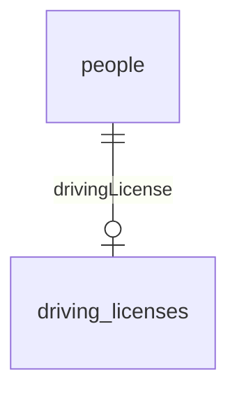
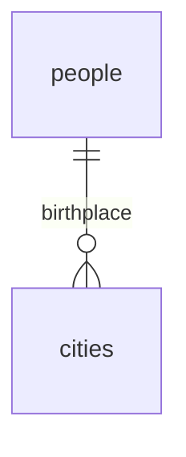
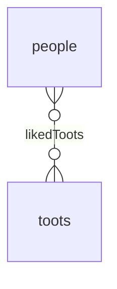

# Basics

Sequelize provides what are called __associations__.
These can be declared on your models to define common [__relationships__](https://en.wikipedia.org/wiki/Cardinality_(data_modeling)) between your tables.

The two concepts are closely related, but not the same. __Associations__ are defined in JavaScript between your _models_, while
__relationships__ are defined in your database between your _tables_.

Sequelize supports the standard associations: [One-To-One](https://en.wikipedia.org/wiki/One-to-one_%28data_model%29), [One-To-Many](https://en.wikipedia.org/wiki/One-to-many_%28data_model%29) and [Many-To-Many](https://en.wikipedia.org/wiki/Many-to-many_%28data_model%29).

## One-to-one Relationships

In a One-To-One relationship, a row of one table is associated with a single row of another table. 

The most common type of One-To-One relationship is one where one side is mandatory, and the other side is optional.
For instance, a driving license always belongs to a single person, but a person can have zero or one driving licenses <small>(from the same place)</small>.

One-To-One relationships can be created by using __the [`HasOne`](./has-one.md) association__.

## One-to-many Relationships

In a One-To-Many relationship, a row of one table is associated with _zero, one or more_ rows of another table.

For instance, a person is always born in one city, but a city can have zero or more people born in it.

One-To-Many relationships can be created by using __the [`HasMany`](./has-many.md) association__.

## Many-to-many Relationships

In a Many-To-Many relationship, a row of one table is associated with _zero, one or more_ rows of another table, and vice versa.

For instance, a person can have liked zero or more Toots, and a Toot can have been liked by zero or more people.

Many-To-Many relationships can be created by using __the [`BelongsToMany`](./belongs-to-many.md) association__.
