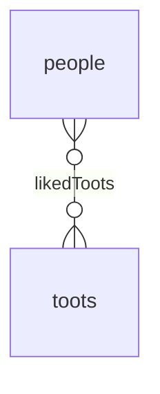
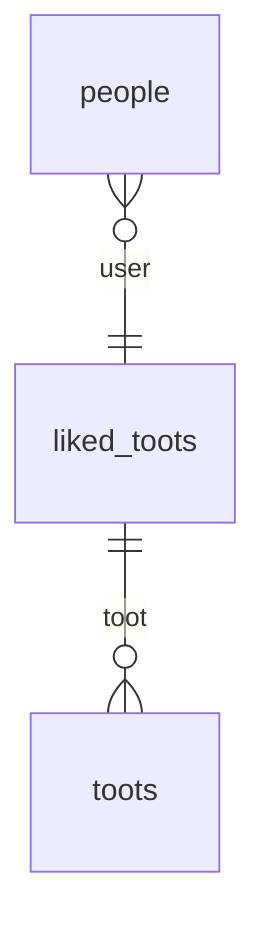

# The BelongsToMany Association

The BelongsToMany association is used to create a [Many-To-Many relationship](https://en.wikipedia.org/wiki/Many-to-many_(data_model)) between two models.

In a Many-To-Many relationship, a row of one table is associated with _zero, one or more_ rows of another table, and vice versa.

For instance, a person can have liked zero or more Toots, and a Toot can have been liked by zero or more people.



Because foreign keys can only point to a single row, Many-To-Many relationships are implemented using a junction table (called __through table__ in Sequelize), and are 
really just two One-To-Many relationships.



The junction table is used to store the foreign keys of the two associated models.

## Defining the Association

Here is how you would define the `Person` and `Toot` models in Sequelize:

```ts
import { Model, InferAttributes, InferCreationAttributes, NonAttribute } from '@sequelize/core';
import { BelongsToMany } from '@sequelize/core/decorators-legacy';

class Person extends Model<InferAttributes<Person>, InferCreationAttributes<Person>> {
  // highlight-start
  @BelongsToMany(() => Toot, {
    through: 'LikedToot',
  })
  declare likedToots?: NonAttribute<Toot[]>;
  // highlight-end
}

class Toot extends Model<InferAttributes<Toot>, InferCreationAttributes<Toot>> {}
```

In the example above, the `Person` model has a Many-To-Many relationship with the `Toot` model, using the `LikedToot` junction model.

The `LikedToot` model is automatically generated by Sequelize, and will receive the two foreign keys: `userId` and `tootId`.

:::caution `through` option

The `through` option is not a table name but a model name. Its corresponding table name will be generated by Sequelize, and
can be customized via the [naming strategy API](../models/naming-strategies.mdx#table-names).

:::

## Customizing the Junction Table

The junction table can be customized by creating the model yourself, and passing it to the `through` option. 
This is useful if you want to add additional attributes to the junction table.

```ts
import { Model, DataTypes, InferAttributes, InferCreationAttributes, NonAttribute } from '@sequelize/core';
import { BelongsToMany, Attribute, NotNull } from '@sequelize/core/decorators-legacy';
import { PrimaryKey } from './attribute.js';

class Person extends Model<InferAttributes<Person>, InferCreationAttributes<Person>> {
  @BelongsToMany(() => Toot, {
    through: () => LikedToot,
  })
  declare likedToots?: NonAttribute<Toot[]>;
}

class LikedToot extends Model<InferAttributes<LikedToot>, InferCreationAttributes<LikedToot>> {
  declare likedById: number;
  declare likedTootId: number;
}

class Toot extends Model<InferAttributes<Toot>, InferCreationAttributes<Toot>> {}
```

In TypeScript, you need to declare the typing of your foreign keys, but they will still be configured by Sequelize automatically.  
You can still, of course, use any [attribute decorator](../models/defining-models.mdx) to customize them.

## Inverse Association

The `BelongsToMany` association automatically creates the inverse association on the target model, which is also a `BelongsToMany` association.

You can customize the inverse association by using the `inverse` option:

```ts
import { Model, InferAttributes, InferCreationAttributes, NonAttribute } from '@sequelize/core';
import { BelongsToMany } from '@sequelize/core/decorators-legacy';

class Person extends Model<InferAttributes<Person>, InferCreationAttributes<Person>> {
  @BelongsToMany(() => Toot, {
    through: 'LikedToot',
    inverse: {
      as: 'likedBy',
    },
  })
  declare likedToots?: NonAttribute<Toot[]>;
}

class Toot extends Model<InferAttributes<Toot>, InferCreationAttributes<Toot>> {
  /** Declared by {@link Person.likedToots} */
  declare likedBy?: NonAttribute<Person[]>;
}
```

## Foreign Keys Names

Sequelize will generate foreign keys automatically based on the names of your associations. 
It is the name of your association + the name of the attribute the association is pointing to (which defaults to the primary key).  

In the example above, the foreign keys would be `likedById` and `likedTootId`, because the associations are called `likedToots` and `likedBy`,
and the primary keys referenced by the foreign keys are both called `id`.

You can customize the foreign keys by using the `foreignKey` and `otherKey` options. The `foreignKey` option is the foreign key that
points to the source model, and the `otherKey` is the foreign key that points to the target model.

```ts
class Person extends Model<InferAttributes<Person>, InferCreationAttributes<Person>> {
  @BelongsToMany(() => Toot, {
    through: 'LikedToot',
    inverse: {
      as: 'likedBy',
    },
    // highlight-start
    // This foreign key points to the Person model
    foreignKey: 'personId',
    // This foreign key points to the Toot model
    otherKey: 'tootId',
    // highlight-end
  })
  declare likedToots?: NonAttribute<Toot[]>;
}
```

## Foreign Key targets (`sourceKey`, `targetKey`)

By default, Sequelize will use the primary key of the source & target models as the attribute the foreign key references.
You can customize this by using the `sourceKey` & `targetKey` option.

The `sourceKey` option is the attribute from the model on which the association is defined, 
and the `targetKey` is the attribute from the target model.

```ts
class Person extends Model<InferAttributes<Person>, InferCreationAttributes<Person>> {
  @BelongsToMany(() => Toot, {
    through: 'LikedToot',
    inverse: {
      as: 'likedBy',
    },
    // highlight-start
    // The foreignKey will reference the 'id' attribute of the Person model
    sourceKey: 'id',
    // The otherKey will reference the 'id' attribute of the Toot model
    targetKey: 'id',
    // highlight-end
  })
  declare likedToots?: NonAttribute<Toot[]>;
}
```

## Through Pair Unique Constraint

The BelongsToMany association creates a unique key on the foreign keys of the through model. 

This unique key name can be changed using the `through.unique` option. You can also set it to `false` to disable the unique constraint altogether.

```ts
class Person extends Model<InferAttributes<Person>, InferCreationAttributes<Person>> {
  @BelongsToMany(() => Toot, {
    through: {
      model: 'LikedToot',
      // highlight-next-line
      unique: false,
    },
  })
  declare likedToots?: NonAttribute<Toot[]>;
}
```

## Association Methods
