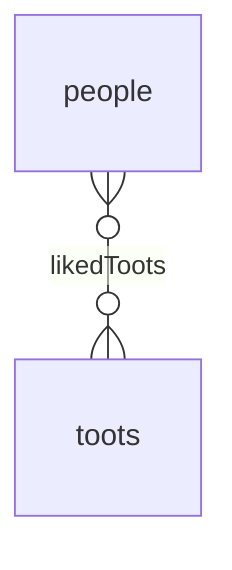

In a Many-To-Many relationship, a row of one table is associated with _zero, one or more_ rows of another table, and vice versa.

For instance, a person can have liked zero or more Toots, and a Toot can have been liked by zero or more people.

Many-To-Many relationships can be created by using __the [`BelongsToMany`](./belongs-to-many.md) association__.

Because foreign keys can only point to a single row,
the only way to create a Many-To-Many relationship in a database is by using a junction table (called __through table__ in Sequelize).