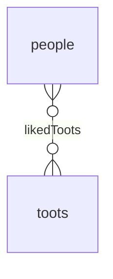
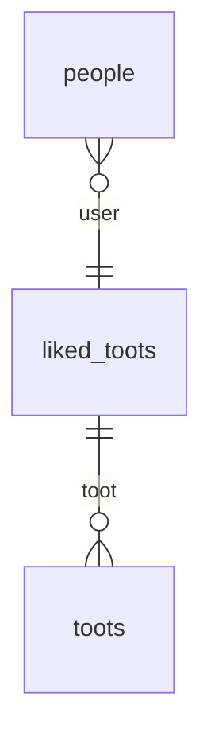

# The BelongsToMany Association

The BelongsToMany association is used to create a [Many-To-Many relationship](https://en.wikipedia.org/wiki/Many-to-many_(data_model)) between two models.

In a Many-To-Many relationship, a row of one table is associated with _zero, one or more_ rows of another table, and vice versa.

For instance, a person can have liked zero or more Toots, and a Toot can have been liked by zero or more people.



Because foreign keys can only point to a single row, Many-To-Many relationships are implemented using a junction table (called __through table__ in Sequelize), and are 
really just two One-To-Many relationships.



The junction table is used to store the foreign keys of the two associated models.

## Defining the Association

Here is how you would define the `Person` and `Toot` models in Sequelize:

```ts
import { Model, InferAttributes, InferCreationAttributes, NonAttribute } from '@sequelize/core';
import { BelongsToMany } from '@sequelize/core/decorators-legacy';

class Person extends Model<InferAttributes<Person>, InferCreationAttributes<Person>> {
  // highlight-start
  @BelongsToMany(() => Toot, {
    through: 'LikedToot',
  })
  declare likedToots?: NonAttribute<Toot[]>;
  // highlight-end
}

class Toot extends Model<InferAttributes<Toot>, InferCreationAttributes<Toot>> {}
```

In the example above, the `Person` model has a Many-To-Many relationship with the `Toot` model, using the `LikedToot` junction model.

The `LikedToot` model is automatically generated by Sequelize, if it does not already exist,
and will receive the two foreign keys: `userId` and `tootId`.

:::caution String `through` option

The `through` option is used to specify the through __model__, not the through __table__.  
We recommend that you follow the same naming conventions as other models (i.e. PascalCase & singular):

```ts
class Person extends Model<InferAttributes<Person>, InferCreationAttributes<Person>> {
  @BelongsToMany(() => Toot, {
    // You should name this LikedToot instead.
    // error-next-line
    through: 'liked_toots',
  })
  declare likedToots?: NonAttribute<Toot[]>;
}
```

:::

## Customizing the Junction Table

The junction table can be customized by creating the model yourself, and passing it to the `through` option. 
This is useful if you want to add additional attributes to the junction table.

```ts
import { Model, DataTypes, InferAttributes, InferCreationAttributes, NonAttribute } from '@sequelize/core';
import { BelongsToMany, Attribute, NotNull } from '@sequelize/core/decorators-legacy';
import { PrimaryKey } from './attribute.js';

class Person extends Model<InferAttributes<Person>, InferCreationAttributes<Person>> {
  @BelongsToMany(() => Toot, {
    through: () => LikedToot,
  })
  declare likedToots?: NonAttribute<Toot[]>;
}

class LikedToot extends Model<InferAttributes<LikedToot>, InferCreationAttributes<LikedToot>> {
  declare likedById: number;
  declare likedTootId: number;
}

class Toot extends Model<InferAttributes<Toot>, InferCreationAttributes<Toot>> {}
```

In TypeScript, you need to declare the typing of your foreign keys, but they will still be configured by Sequelize automatically.  
You can still, of course, use any [attribute decorator](../models/defining-models.mdx) to customize them.

### Associations with extra attributes on through table

When creating an N:M association, for example, with User and Project through UserProjects you might want extra attributes on the junction table like the "role" attribute.
This relationship can be setup like this:

```ts
class UserProject extends Model<InferAttributes<UserProject>, InferCreationAttributes<UserProject>> {
  @Attribute(DataTypes.STRING)
  declare role: string;

  declare projectId: number;
  declare userId: number;
}

class Project extends Model<InferAttributes<Project>, InferCreationAttributes<Project>> {
  @Attribute(DataTypes.STRING)
  declare name: string;

  declare UserProject?: NonAttribute<UserProject>;
}

class User extends Model<InferAttributes<User>, InferCreationAttributes<User>> {
  @Attribute(DataTypes.STRING)
  declare username: string;

  @BelongsToMany(() => Project, {
    through: UserProject,
  })
  declare projects?: NonAttribute<Project[]>;

  declare getProjects: BelongsToManyGetAssociationsMixin<Project>;
  declare setProjects: BelongsToManySetAssociationsMixin<Project, number>;
  declare addProjects: BelongsToManyAddAssociationsMixin<Project, number>;
}
```

Creating multiple associations with the same extra attributes is possible by passing a single object on the through attribute:
```ts
user1.setProjects([project1, project2, project3], { through: { role: 'admin' }})
```

With the [set](#association-setter-setx) and [add](#association-adder-addx) mixins different extra attributes per association can be set by passing an array of objects of the same length as the ammount of associations:
```ts
user1.setProjects([project1, project2, project3], {
  through: [
    { role: 'admin' },
    { role: 'manager' },
    { role: 'designer' },
  ]
})
(await user1.getProducts()).map(x => x.UserProduct?.role) // [ 'admin', 'manager', 'designer' ]
```

## Inverse Association

The `BelongsToMany` association automatically creates the inverse association on the target model, which is also a `BelongsToMany` association.

You can customize the inverse association by using the `inverse` option:

```ts
import { Model, InferAttributes, InferCreationAttributes, NonAttribute } from '@sequelize/core';
import { BelongsToMany } from '@sequelize/core/decorators-legacy';

class Person extends Model<InferAttributes<Person>, InferCreationAttributes<Person>> {
  @BelongsToMany(() => Toot, {
    through: 'LikedToot',
    inverse: {
      as: 'likedBy',
    },
  })
  declare likedToots?: NonAttribute<Toot[]>;
}

class Toot extends Model<InferAttributes<Toot>, InferCreationAttributes<Toot>> {
  /** Declared by {@link Person.likedToots} */
  declare likedBy?: NonAttribute<Person[]>;
}
```

## Foreign Keys Names

Sequelize will generate foreign keys automatically based on the names of your associations. 
It is the name of your association + the name of the attribute the association is pointing to (which defaults to the primary key).  

In the example above, the foreign keys would be `likedById` and `likedTootId`, because the associations are called `likedToots` and `likedBy`,
and the primary keys referenced by the foreign keys are both called `id`.

You can customize the foreign keys by using the `foreignKey` and `otherKey` options. The `foreignKey` option is the foreign key that
points to the source model, and the `otherKey` is the foreign key that points to the target model.

```ts
class Person extends Model<InferAttributes<Person>, InferCreationAttributes<Person>> {
  @BelongsToMany(() => Toot, {
    through: 'LikedToot',
    inverse: {
      as: 'likedBy',
    },
    // highlight-start
    // This foreign key points to the Person model
    foreignKey: 'personId',
    // This foreign key points to the Toot model
    otherKey: 'tootId',
    // highlight-end
  })
  declare likedToots?: NonAttribute<Toot[]>;
}
```

## Foreign Key targets (`sourceKey`, `targetKey`)

By default, Sequelize will use the primary key of the source & target models as the attribute the foreign key references.
You can customize this by using the `sourceKey` & `targetKey` option.

The `sourceKey` option is the attribute from the model on which the association is defined, 
and the `targetKey` is the attribute from the target model.

```ts
class Person extends Model<InferAttributes<Person>, InferCreationAttributes<Person>> {
  @BelongsToMany(() => Toot, {
    through: 'LikedToot',
    inverse: {
      as: 'likedBy',
    },
    // highlight-start
    // The foreignKey will reference the 'id' attribute of the Person model
    sourceKey: 'id',
    // The otherKey will reference the 'id' attribute of the Toot model
    targetKey: 'id',
    // highlight-end
  })
  declare likedToots?: NonAttribute<Toot[]>;
}
```

## Through Pair Unique Constraint

The BelongsToMany association creates a unique key on the foreign keys of the through model. 

This unique key name can be changed using the `through.unique` option. You can also set it to `false` to disable the unique constraint altogether.

```ts
class Person extends Model<InferAttributes<Person>, InferCreationAttributes<Person>> {
  @BelongsToMany(() => Toot, {
    through: {
      model: 'LikedToot',
      // highlight-next-line
      unique: false,
    },
  })
  declare likedToots?: NonAttribute<Toot[]>;
}
```

## Association Methods

All associations add methods to the source model[^1]. These methods can be used to fetch, create, and delete associated models.

If you use TypeScript, you will need to declare these methods on your model class.

### Association Getter (`getX`)

The association getter is used to fetch the associated models. It is always named `get<AssociationName>`:

```ts
import { BelongsToManyGetAssociationsMixin } from '@sequelize/core';

class Author extends Model<InferAttributes<Author>, InferCreationAttributes<Author>> {
  @BelongsToMany(() => Book, { through: 'BookAuthor' })
  declare books?: NonAttribute<Book[]>;

  // highlight-start
  declare getBooks: BelongsToManyGetAssociationsMixin<Book>;
  // highlight-end
}

// ...

const post = await Post.findByPk(1);

// highlight-start
const books: Book[] = await post.getBooks();
// highlight-end
```

### Association Setter (`setX`)

The association setter is used to set the associated models. It is always named `set<AssociationName>`.

If the model is already associated to one or more models, the old associations are removed before the new ones are added.

```ts
import { BelongsToManySetAssociationsMixin } from '@sequelize/core';

class Author extends Model<InferAttributes<Author>, InferCreationAttributes<Author>> {
  @BelongsToMany(() => Book, { through: 'BookAuthor' })
  declare books?: NonAttribute<Book[]>;

  // highlight-start
  declare setBooks: BelongsToManySetAssociationsMixin<
    Book,
    /* this is the type of the primary key of the target */
    Book['id']
  >;
  // highlight-end
}

// ...

const post = await Post.findByPk(1);
const [book1, book2, book3] = await Book.findAll({ limit: 3 });

// highlight-start
// Remove all previous associations and set the new ones
await post.setBooks([book1, book2, book3]);

// You can also use the primary key of the newly associated model as a way to identify it
// without having to fetch it first.
await post.setBooks([1, 2, 3]);
// highlight-end
```

### Association Adder (`addX`)

The association adder is used to add one or more new associated models without removing existing ones.
There are two versions of this method:

- `add<SingularAssociationName>`: Associates a single new model.
- `add<PluralAssociationName>`: Associates multiple new models.

```ts
import { BelongsToManyAddAssociationMixin, BelongsToManyAddAssociationsMixin } from '@sequelize/core';

class Author extends Model<InferAttributes<Author>, InferCreationAttributes<Author>> {
  @BelongsToMany(() => Book, { through: 'BookAuthor' })
  declare books?: NonAttribute<Book[]>;

  // highlight-start
  declare addBook: BelongsToManyAddAssociationMixin<
    Book,
    /* this is the type of the primary key of the target */
    Book['id']
  >;

  declare addBooks: BelongsToManyAddAssociationsMixin<
    Book,
    /* this is the type of the primary key of the target */
    Book['id']
  >;
  // highlight-end
}

// ...

const post = await Post.findByPk(1);
const [book1, book2, book3] = await Book.findAll({ limit: 3 });

// highlight-start
// Add a single book, without removing existing ones
await post.addBook(book1);

// Add multiple books, without removing existing ones
await post.addBooks([book1, book2]);

// You can also use the primary key of the newly associated model as a way to identify it
// without having to fetch it first.
await post.addBook(1);
await post.addBooks([1, 2, 3]);
// highlight-end
```

### Association Remover (`removeX`)

The association remover is used to remove one or more associated models.

There are two versions of this method:

- `remove<SingularAssociationName>`: Removes a single associated model.
- `remove<PluralAssociationName>`: Removes multiple associated models.


```ts
import { BelongsToManyRemoveAssociationMixin, BelongsToManyRemoveAssociationsMixin } from '@sequelize/core';

class Author extends Model<InferAttributes<Author>, InferCreationAttributes<Author>> {
  @BelongsToMany(() => Book, { through: 'BookAuthor' })
  declare books?: NonAttribute<Book[]>;

  // highlight-start
  declare removeBook: BelongsToManyRemoveAssociationMixin<
    Book,
    /* this is the type of the primary key of the target */
    Book['id']
  >;

  declare removeBooks: BelongsToManyRemoveAssociationsMixin<
    Book,
    /* this is the type of the primary key of the target */
    Book['id']
  >;
  // highlight-end
}

// ...

const post = await Post.findByPk(1);
const [book1, book2, book3] = await Book.findAll({ limit: 3 });

// highlight-start
// Remove a single book, without removing existing ones
await post.removeBook(book1);

// Remove multiple books, without removing existing ones
await post.removeBooks([book1, book2]);

// You can also use the primary key of the newly associated model as a way to identify it
// without having to fetch it first.
await post.removeBook(1);
await post.removeBooks([1, 2, 3]);
// highlight-end
```

### Association Creator (`createX`)

The association creator is used to create a new associated model and associate it with the source model. It is always named `create<AssociationName>`.

```ts
import { BelongsToManyCreateAssociationMixin } from '@sequelize/core';

class Author extends Model<InferAttributes<Author>, InferCreationAttributes<Author>> {
  @BelongsToMany(() => Book, { through: 'BookAuthor' })
  declare books?: NonAttribute<Book[]>;

  // highlight-start
  declare createBook: BelongsToManyCreateAssociationMixin<Book, 'postId'>;
  // highlight-end
}

// ...

const post = await Post.findByPk(1);

// highlight-start
const book = await post.createBook({
  content: 'This is a book',
});
// highlight-end
```

:::info Omitting the foreign key

In the example above, we did not need to specify the `postId` attribute. This is because Sequelize will automatically add it to the creation attributes.

If you use TypeScript, you need to let TypeScript know that the foreign key is not required. You can do so using the second generic argument of the `BelongsToManyCreateAssociationMixin` type.

```ts
BelongsToManyCreateAssociationMixin<Book, 'postId'>
                                        ^ Here
```

:::

### Association Checker (`hasX`)

The association checker is used to check if a model is associated with another model. It has two versions:

- `has<SingularAssociationName>`: Checks if a single model is associated.
- `has<PluralAssociationName>`: Checks whether all the specified models are associated.

```ts
import { BelongsToManyHasAssociationMixin, BelongsToManyHasAssociationsMixin } from '@sequelize/core';

class Author extends Model<InferAttributes<Author>, InferCreationAttributes<Author>> {
  @BelongsToMany(() => Book, { through: 'BookAuthor' })
  declare books?: NonAttribute<Book[]>;

  // highlight-start
  declare hasBook: BelongsToManyHasAssociationMixin<
    Book,
    /* this is the type of the primary key of the target */
    Book['id']
  >;

  declare hasBooks: BelongsToManyHasAssociationsMixin<
    Book,
    /* this is the type of the primary key of the target */
    Book['id']
  >;
  // highlight-end
}

// ...

const post = await Post.findByPk(1);

// highlight-start
// Returns true if the post has a book with id 1
const isAssociated = await post.hasBook(book1);

// Returns true if the post is associated to all specified books
const isAssociated = await post.hasBooks([book1, book2, book3]);

// Like other association methods, you can also use the primary key of the associated model as a way to identify it
const isAssociated = await post.hasBooks([1, 2, 3]);
// highlight-end
```

### Association Counter (`countX`)

The association counter is used to count the number of associated models. It is always named `count<AssociationName>`.

```ts
import { BelongsToManyCountAssociationsMixin } from '@sequelize/core';

class Author extends Model<InferAttributes<Author>, InferCreationAttributes<Author>> {
  @BelongsToMany(() => Book, { through: 'BookAuthor' })
  declare books?: NonAttribute<Book[]>;

  // highlight-start
  declare countBooks: BelongsToManyCountAssociationsMixin<Book>;
  // highlight-end
}

// ...

const post = await Post.findByPk(1);

// highlight-start
// Returns the number of associated books
const count = await post.countBooks();
// highlight-end
```

[^1]: The source model is the model that defines the association.
