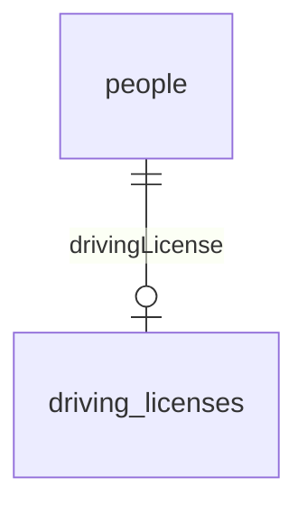
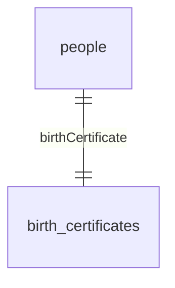

# The HasOne Association

The HasOne association is used to create a One-To-One relationship between two models.

In a One-To-One relationship, a row of one table is associated with a single row of another table.

The most common type of One-To-One relationship is one where one side is mandatory, and the other side is optional. 
For instance, a driving license always belongs to a single person, but a person can have zero or one driving licenses (from the same place).



## Defining the Association

Here is how you would define the `Person` and `DrivingLicense` models in Sequelize:

```ts
import { Model, DataTypes, InferAttributes, InferCreationAttributes, CreationOptional, NonAttribute } from '@sequelize/core';
import { PrimaryKey, Attribute, AutoIncrement, NotNull, HasOne, BelongsTo } from '@sequelize/core/decorators-legacy';

class Person extends Model<InferAttributes<Person>, InferCreationAttributes<Person>> {
  @Attribute(DataTypes.INTEGER)
  @AutoIncrement
  @PrimaryKey
  declare id: CreationOptional<number>;

  // highlight-start
  @HasOne(() => DrivingLicense, /* foreign key */ 'ownerId')
  declare drivingLicense?: NonAttribute<DrivingLicense>;
  // highlight-end
}

class DrivingLicense extends Model<InferAttributes<DrivingLicense>, InferCreationAttributes<DrivingLicense>> {
  @Attribute(DataTypes.INTEGER)
  @AutoIncrement
  @PrimaryKey
  declare id: CreationOptional<number>;

  // highlight-start
  // This is the foreign key
  @Attribute(DataTypes.INTEGER)
  @NotNull
  declare ownerId: number;
  // highlight-end
}
```

Note that in the example above, the `DrivingLicense` model has a foreign key to the `Person` model. __`HasOne` adds the foreign key
on the model the association targets.__

Always think about which model should own the foreign key, as the foreign key is the one that enforces the relationship.

In this case, because the driving license model has a non-null foreign key, 
it is impossible to create a Driving License without assigning it to a Person.  
However, it's possible to create a Person without a Driving License.

If you made the foreign key nullable, the relationship would be optional on both sides.

:::info Unique FK

When using `HasOne`, you may want to add a unique constraint on the foreign key to ensure that only one row can be associated with the source row.

You can do this by using the `@Unique` decorator on the foreign key:

```ts
class DrivingLicense extends Model<InferAttributes<DrivingLicense>, InferCreationAttributes<DrivingLicense>> {
  @Attribute(DataTypes.INTEGER)
  @NotNull
  // highlight-next-line
  @Unique
  declare ownerId: number;
}
```

:::

## Inverse association

The `HasOne` association automatically creates an inverse association on the target model. 
The inverse association is a [`BelongsTo`](./belongs-to.md) association.

You can configure that inverse association by using the `inverse` option:

```ts
import { Model, DataTypes, InferAttributes, InferCreationAttributes, CreationOptional, NonAttribute } from '@sequelize/core';
import { PrimaryKey, Attribute, AutoIncrement, NotNull, HasOne, BelongsTo } from '@sequelize/core/decorators-legacy';

class Person extends Model<InferAttributes<Person>, InferCreationAttributes<Person>> {
  @Attribute(DataTypes.INTEGER)
  @AutoIncrement
  @PrimaryKey
  declare id: CreationOptional<number>;
  
  @HasOne(() => DrivingLicense, {
    foreignKey: 'ownerId',
    // highlight-start
    inverse: {
      as: 'owner',
    },
    // highlight-end
  })
  declare drivingLicense?: NonAttribute<DrivingLicense>;
}

class DrivingLicense extends Model<InferAttributes<DrivingLicense>, InferCreationAttributes<DrivingLicense>> {
  @Attribute(DataTypes.INTEGER)
  @AutoIncrement
  @PrimaryKey
  declare id: CreationOptional<number>;
  
  // highlight-start
  /** Defined by {@link Person.drivingLicense} */
  declare owner?: NonAttribute<Person>;
  // highlight-end

  @Attribute(DataTypes.INTEGER)
  @NotNull
  declare ownerId: number;
}
```

## Association Methods

All associations add methods to the source model[^1]. These methods can be used to fetch, create, and delete associated models.

If you use TypeScript, you will need to declare these methods on your model class.

### Association Getter (`getX`)

The association getter is used to fetch the associated model. It is always named `get<AssociationName>`:

```ts
import { HasOneGetAssociationMixin } from '@sequelize/core';

class Person extends Model<InferAttributes<Person>, InferCreationAttributes<Person>> {
  @HasOne(() => DrivingLicense, 'ownerId')
  declare drivingLicense?: NonAttribute<DrivingLicense>;
  
  // highlight-start
  declare getDrivingLicense: HasOneGetAssociationMixin<DrivingLicense>;
  // highlight-end
}

// ...

const person = await Person.findByPk(1);

// highlight-start
const drivingLicense: DrivingLicense | null = await person.getDrivingLicense();
// highlight-end
```

### Association Setter (`setX`)

The association setter is used to set (or unset) which model is associated to this one. It is always named `set<AssociationName>`.  
It accepts a single model instance, or `null` to unset the association.

```ts
import { HasOneSetAssociationMixin } from '@sequelize/core';

class Person extends Model<InferAttributes<Person>, InferCreationAttributes<Person>> {
  @HasOne(() => DrivingLicense, 'ownerId')
  declare drivingLicense?: NonAttribute<DrivingLicense>;
  
  // highlight-start
  declare setDrivingLicense: HasOneSetAssociationMixin<
    DrivingLicense, 
    /* this is the type of the primary key of the target */ 
    DrivingLicense['id']
  >;
  // highlight-end
}

// ...

const person = await Person.findByPk(1);
const drivingLicense = await DrivingLicense.create({ /* ... */ });

// highlight-start
// Note: If the driving license already has an owner, it will be replaced by the new owner.
await person.setDrivingLicense(drivingLicense);

// You can also use the primary key of the newly associated model as a way to identify it
// without having to fetch it first.
await person.setDrivingLicense(5);

// Removes the driving license from the person
await person.setDrivingLicense(null);
// highlight-end
```

:::caution

If the foreign key is not nullable, calling this method will delete the previously associated model (if any),
as setting its foreign key to `null` would result in a validation error.

If the foreign key is nullable, it will by default set it to null. You can use the `destroyPrevious` option to delete
the previously associated model instead:

```ts
await person.setDrivingLicense(newDrivingLicense, { destroyPrevious: true });
```

:::

### Association Creator (`createX`)

The association creator is used to create a new associated model. It is always named `create<AssociationName>`.
It accepts the same arguments as the associated model's `create` method.

```ts
import { HasOneCreateAssociationMixin } from '@sequelize/core';

class Person extends Model<InferAttributes<Person>, InferCreationAttributes<Person>> {
  @HasOne(() => DrivingLicense, 'ownerId')
  declare drivingLicense?: NonAttribute<DrivingLicense>;
  
  // highlight-start
  declare createDrivingLicense: HasOneCreateAssociationMixin<DrivingLicense, 'ownerId'>;
  // highlight-end
}

// ...

const person = await Person.findByPk(1);

// highlight-start
const drivingLicense: DrivingLicense = await person.createDrivingLicense({
  number: '123456789',
});
// highlight-end
```

:::info Omitting the foreign key

In the example above, we did not need to specify the `ownerId` attribute. This is because Sequelize will automatically add it to the creation attributes.

If you use TypeScript, you need to let TypeScript know that the foreign key is not required. You can do so using the second generic argument of the `HasOneCreateAssociationMixin` type.

```ts
HasOneCreateAssociationMixin<DrivingLicense, 'ownerId'>
                                              ^ Here
```

:::

### Inverse Association Methods

The [inverse association](#inverse-association) also adds methods to its source model. See [the `BelongsTo` documentation](./belongs-to.md#association-methods) for the list of methods.

## Making the association mandatory on both sides

In theory, a One-To-One relationship can also be mandatory on both sides.
For instance, a person always has a birth certificate, and a birth certificate always belongs to a person.



In practice however, it is impossible to enforce this relationship in a database. You need to handle this in your business logic.

## Foreign Key targets (`sourceKey`)

By default, Sequelize will use the primary key of the source model as the attribute the foreign key references.
You can customize this by using the `sourceKey` option.

```ts
class Person extends Model {
  declare id: CreationOptional<number>;
  
  @HasOne(() => DrivingLicense, {
    foreignKey: 'ownerId',
    // highlight-next-line
    // The foreign key will reference the `id` attribute of the `Person` model
    sourceKey: 'id',
  })
  declare drivingLicense?: NonAttribute<DrivingLicense>;
}
```

[^1]: The source model is the model that defines the association.
