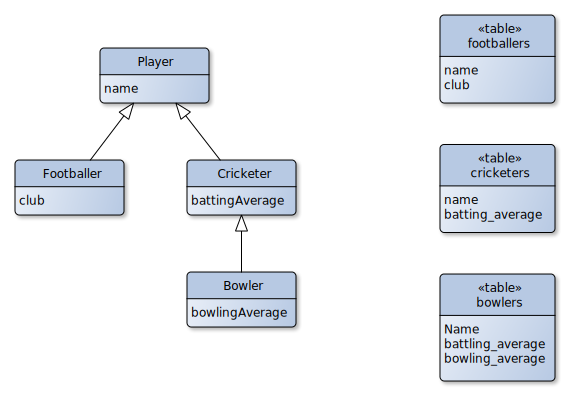

Model inheritance is a way to share common attributes and methods between models.

Sequelize supports a style of inheritance called **Concrete Table Inheritance**. This means that each [non-abstract](#abstract-models)
model in the hierarchy has its own table in the database:

<figure>



<figcaption>Concrete Table Inheritance - <a href="https://commons.wikimedia.org/wiki/File:Concrete_Table_Inheritance.svg">Source</a></figcaption>

</figure>

Here is how you would implement this in Sequelize:

```ts
import { Model, InferAttributes, InferCreationAttributes } from '@sequelize/core';
import { Attribute, Default, PrimaryKey, NotNull } from '@sequelize/core/decorators-legacy';
import { SqliteDialect } from '@sequelize/sqlite3';

@Table.Abstract
class Player<M extends Player = Player> extends Model<
  InferAttributes<M>,
  InferCreationAttributes<M>
> {
  @Attribute(DataTypes.STRING)
  @NotNull
  declare name: string;
}

class Footballer extends Player<Footballer> {
  @Attribute(DataTypes.STRING)
  @NotNull
  declare club: string;
}

class Cricketer<M extends Cricketer = Cricketer> extends Player<M> {
  @Attribute(DataTypes.INTEGER)
  @NotNull
  declare battingAverage: number;
}

class Bowler extends Cricketer<Bowler> {
  @Attribute(DataTypes.INTEGER)
  @NotNull
  declare bowlingAverage: number;
}

const sequelize = new Sequelize({
  dialect: SqliteDialect,
  models: [Footballer, Cricketer],
});
```

## Abstract Models

Some models are not meant to be used directly. They are meant to be used as a base class for other models.
Those models are called abstract models.

Those models should not be registered in the `Sequelize` instance, to prevent them from creating a table in the database.
To prevent a model from being registered, you can use the [`@Table.Abstract`] decorator instead of [`@Table`] on the model class.

```ts
@Table.Abstract
abstract class BaseModel extends Model {
  // ...
}
```

This decorator accepts the same options as the [`@Table`] decorator, except for `name` and `tableName`,
as these options cannot be inherited.

## Limitations

You cannot define [`@HasOne`](../associations/has-one.md), [`@HasMany`](../associations/has-many.md), or [`@BelongsToMany`](../associations/belongs-to-many.md)
associations on inherited models (the parent model).

This limitation is due to the fact that these associations declare a foreign key on the target model.
Having multiple models attempting to declare the same foreign key is not possible, as a foreign key can only point to a single model.

Similarly, you cannot use the `inverse` option on [`@BelongsTo`](../associations/belongs-to.md) associations on inherited models,
as this option declares an association on the target model, whose name must be unique.

[`@Table.Abstract`]: pathname:///v7/variables/_sequelize_core.decorators_legacy.table.abstract
[`@Table`]: pathname:///api/v7/functions/_sequelize_core.decorators_legacy.table-1
